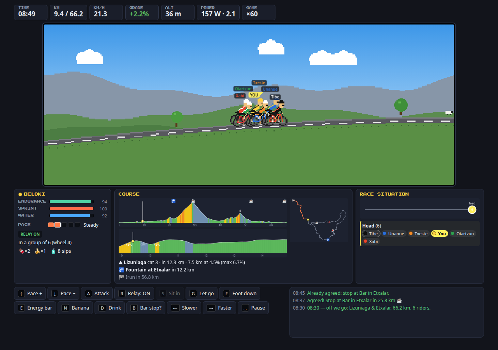

# Igandeko Irteera — Irun Sunday ride simulator



A Sunday amateur group-ride simulator in the spirit of Pro Cycling Manager, with RPG bits.
It runs in the browser; a Game Boy Color port can come later (the simulation is kept free of DOM code for that).

```
open index.html            # double-click it, or: xdg-open index.html
```

No server, no build step: it works straight from `file://`. Fonts come from Google Fonts when online (falls back to monospace).
URL options: `?lang=xx` language, `?fast=1` instant text, `?seed=123` replay the same Sunday.

## A Sunday, stage by stage

| Stage | What happens |
|---|---|
| **0 · Rider** | Pick a rider from `config/players.js` (endurance, sprint, fitness, competitiveness, clumsiness, weight, gender, portrait). Stats are explained; your career level, perks and sportiveness are shown. |
| **1 · WhatsApp** | Saturday 21:30 in *Igandeko Irteera*. Propose **a ride from Irun** (departure 08:00–09:30), **a car trip** (you drive, 3 free seats, to one of 11 areas) or **an epic sportive** (Paris-Roubaix Challenge, Tour of Flanders, Lagos de Covadonga…). Sometimes someone else posts a car trip or an epic first and you can join. Replies depend on fitness, distance, drive time, weather and how much they like you. When the car is full a second driver may offer, or the late ones are left out. One chance to insist. |
| **2 · Morning** | 1 or 2 bidons, food for 3 pockets, a glance at the chat: **Denis slept badly 50% of the time**, maybes decide, someone else may drop. |
| **3 · Meeting point** | Darío de Regoyos — or load the bikes and drive to the area (time passes), or the start line of the sportive. Propose a route (votes depend on form, endurance, competitiveness, favourite bars, your relationship). Talk: provoke, challenge, praise, calm. |
| **4 · The ride** | See below. |
| **5 · Bar / feed station** | Stops agreed on the road (bars, feed stations on sportives; fountains are quick automatic water refills). Energy-bar-like boost, bidons refilled, a table compares everybody's endurance, sprint, water and form; talk, buy food, save. |
| **Results** | Arrival order (group finishes are sprinted), KOMs, falls, pulls, power, lunch time; **relationship changes** per rider with the reasons; **sportiveness** score and what it came from; XP, levels, perks. |

## The ride

Side-scrolling pixel view on the real elevation (×3 vertical), HUD, colour-coded profile, 6 km zoom, map, race-situation panel (groups on a time axis, attackers ⚡, chasers 🏃, waiting ⏸, foot down 🦶, fallen 💥, at the bar ☕, home 🏠).

| Key | Action |
|---|---|
| ↑ / ↓ | Pace up / down. ↑ in a group takes you to the front to push the pace. |
| A | Attack (costs sprint bar; impossible when bonked). Right after someone attacks: follow them. |
| R | Relay on/off. S: sit in. G: let them go / ride on when the group is waiting. |
| **F** | **Put a foot down** at any time: wait (friendly — the slow ones thank you), wait and mock them (competitive ones become rivals, the others are hurt), or, when you are behind, stop so the ones ahead feel guilty and wait (emotional blackmail; costs sportiveness). F or ↑ to ride again. |
| E / N / D | Energy bar / banana / drink. B: ask for a stop at the next bar. |
| ← / → | Game speed ×1 … ×60. Space: pause → save, controls, save & quit, go home. |

Leaving a group that waits for you (G on a summit regroup, a crash…) makes them angry, and the competitive ones may **chase you down**.

### Simulation

- **Physics:** rolling resistance (higher on cobbles), gravity, aero drag scaled with each rider's **weight**; drafting saves 36% of the aero cost. Braking limit on descents (clumsy, rain, bonked).
- **Power:** threshold power from fitness and weight (heavy riders push more watts, fewer W/kg). Daily form ±8.
- **Endurance bar** drains with intensity² ÷ endurance; below 40% sustainable power drops, and **bonking (below 5%) is brutal**: 40% of threshold, no sprint bar, can't hold any wheel or attack, slower and riskier downhill — until food kicks in.
- **Sprint bar** = W′ balance sized by the sprint stat. **Water** drains faster in the heat.
- **Groups:** rotating pulls, non-relayers at the back, riders dropped when they can't hold the speed even with the sprint bar, merges, friendly pullers who wait for the weakest, strong riders who **set their own tempo on climbs**, competitive riders who **chase down small breakaways**, attacks and responses, regrouping at summits (friendly groups), coffee requests, going home when empty.
- **Calibration** (`node tools/simtest.js jaizkibel Xabi 1 30`): average speeds match the real rides (Jaizkibel ≈24 km/h, Goizueta 121 km ≈5 h); the strong riders (Beloki, Unanue, Txeste, Tibe) win; Aizpea never wins Jaizkibel, even at threshold; weak riders abandon the epics.
- **Clumsiness:** crashes (more downhill, rain, cobbles, fatigue, chain crashes); wait or ride on, the AI votes too; the fallen rider chases or goes home.

### Relationships, sportiveness, progression

Every rider has a mood towards you that **persists between Sundays** (career save). It changes with what you do: waiting after crashes, foot-down regroups, relaying or wheel-sucking, taunts and praise, mocking, guilt-tripping, leaving them waiting, coffee requests. Mood affects WhatsApp replies, route votes, whether they wait for you after a crash or at a summit, whether they stop when you guilt them. **Sportiveness** sums the fair-play side of your actions; it appears in the results, adds XP when positive and accumulates in the career. Levels give perks; hard rides give +1 fitness (max +10).

## Riders: config/players.js

The roster is read at startup from **`config/players.js`** — edit it and reload, no build needed:

- **Add a rider:** copy a block and change the name and stats. **Remove one:** delete the block. The order is the order on screen.
- **Stats:** `endurance`, `sprint`, `fitness`, `competitiveness`, `clumsiness` (0–100), `weight` (kg), `gender` (`"m"`/`"f"`).
- **Look:** `colors` (`jersey`, `trim`, `bike`, `helmet`, `hair`; generated from the name if missing) and `portrait`, an image path such as `"config/portraits/xabi.jpg"` (see `config/portraits/README.txt`). `"portraitStyle": "pixel"` pixelates photos to match the art, `"photo"` shows them as they are; riders without a picture get a pixel-art face. Portraits appear in the rider select, WhatsApp, meeting point, bar and results.
- **Personality:** `tagline` (per language, e.g. `{"en": "...", "eu": "..."}`; generated from the stats if missing), `favouriteStops` (stop ids they love, e.g. `"almandoz"`), `badSleeper` (0–1 chance of sleeping badly and dropping out on Sunday morning — Denis has 0.5). `everybodyLikes` lists stops every rider is happy to go to.
- Mistakes are tolerated: the game fixes what it can (out-of-range numbers, bad colours, duplicate names) and lists the problems on the rider select screen. `python3 tools/import_players.py --check` validates the file.
- **From the spreadsheet:** `python3 tools/import_players.py` copies the stats of `inputs/player_stats.ods` into the config (adding new riders, keeping colours, portraits and taglines); `--prune` also removes riders no longer in the sheet.
- **Private overrides:** `config/players.local.js` (git-ignored, optional) is merged on top by rider name — e.g. `{"players": {"Xabi": {"portrait": "config/portraits/xabi.jpg"}}}`. Use it for personal photos. `?nolocal=1` ignores it.
- Careers and relationships are keyed by name. Saves keep working when riders are added or removed (removed ones simply stop appearing).

## Saving

- The game **autosaves** at every stage and every 20 s during the ride → *Continue* on the title screen.
- **3 save slots** (💾 button on the dialogue stages, pause menu during the ride, the bar menu) and **download a save file** (load it back from *Load game → Load a save file*). A save contains the whole career (levels, perks, relationships) plus the current Sunday, mid-ride included.
- Saves live in the browser's `localStorage`; download a file to keep them safe across browsers or after clearing site data.

## Translating

All texts (dialogues, chat lines, menus, logs, route names) live in **`i18n/en.js`**, read at startup. **Basque** is included: `i18n/eu.js` (*Language → Euskara* on the title screen, or `?lang=eu`). To add a language: copy it to `i18n/<code>.js`, change the first line to `window.I18N.<code> = {`, translate, and add `<code>: 'Name'` to `i18n/languages.js`. It appears under *Language* on the title screen; missing keys fall back to English. Lists (`[...]`) are random variants; any string can become `{ m: '…', f: '…' }` to agree with the gender of the rider it talks about (from the sheet). Keep `{placeholders}`. A language file can also translate place names coming from the data (`places: { 'Urrugne': 'Urruña', … }`); `eu.js` does this for the French Basque Country, Navarre and Alava names. Basque inflects names (Xabik, Denisen…), so `eu.js` phrases sentences to keep `{n}` uninflected ("{n}:", "{n} lagunari").

## Data

`python3 tools/build_routes.py` regenerates `data/routes.js` from `inputs/gpx` (the raw Garmin export is not in the repository; the generated `data/routes.js` is) (no extra packages). Riders live in `config/players.js` (above).

- **40 routes:** 17 Irun loops (start and end within 4 km of Irun), 16 car-trip loops in 11 areas (Lekeitio, Meñaka, Goierri, Itxassou, Garazi, Campezo, Tudela/Moncayo, Ochagavía, Luz-Saint-Sauveur, Landes, Cantabria) and 7 epics (Paris-Roubaix Challenge 2026-04-11, Tour of Flanders sportive 2024-03-30, Lagos de Covadonga, Irati/Larrau, Baigorri, Leitza, Cantabria). Resampled every 25 m, elevation smoothed ±150 m.
- **Stopping places** are detected from every ride's timestamps: pauses of 3+ minutes are clustered; long ones become bars, short ones fountains/regroup points, on epics feed stations (plus official ones every ~40 km). The ten bars of the brief are always present; Irun's is the final coffee. `--stops` prints them all.
- **Climbs** are detected (≥60 m at ≥3.5%), categorised 4…HC and named from known summits (Jaizkibel, Guadalupe, Ibardin, Aritxulegi, Agiña, Lizuniaga, Artikutza, Moncayo, Luz Ardiden, Gavarnie, Abodi, Port de Larrau, Oude Kwaremont, Paterberg, Koppenberg, …) or "Climb near <town>".

### Caveats

- No Irun loop reaches **Almandoz**: that route is stitched from three real rides with a ~1 km straight connector near Oronoz.
- The barometric altitude in the files drifts; each route is pinned to the known altitude of its start (and finish on loops).
- Cobbles are not located precisely: Roubaix and Flanders get cobble rolling resistance and crash risk along the whole route.
- Stop names come from the nearest town in a built-in list; stops far from any listed town are named by km.

## Layout

```
index.html                 entry point (plain <script> tags → works from file://)
i18n/en.js, languages.js   all texts (translatable) and the language list
config/players.js          the riders (stats, colours, portraits, taglines…) — edit freely
config/portraits/          rider portrait images
data/routes.js             generated by tools/build_routes.py
js/util.js                 RNG, formatting, translation lookup, storage, DOM helper
js/players.js              loads and validates config/players.js; avatars / portraits
js/content.js              perks, weather numbers (no text)
js/route.js                route queries, stop / climb names
js/sim.js                  ride simulation: physics, physiology, groups, AI, save/load   (DOM-free)
js/social.js               chat replies, trips, route votes, taunts, sportiveness        (DOM-free)
js/art.js, draw.js         pixel art; map, profiles, race situation
js/ui.js, chat.js          dialogue box, modals, WhatsApp phone
js/save.js                 slots, autosave, save files
js/stages.js               stages 0, 1, 2, 3, 5, results; the Sunday state machine
js/ride.js                 stage 4
tools/build_routes.py      GPX → data/routes.js
tools/import_players.py    player_stats.ods → config/players.js (and --check)
tools/simtest.js           headless rides and statistics
tools/playtest.py          Playwright autopilot through a whole Sunday (TRIP=home|away|epic, ASKBAR=1, CRASHTEST=1, FOOT=1)
tools/savetest.py          save → quit → continue → reload → load slot round trip
```
